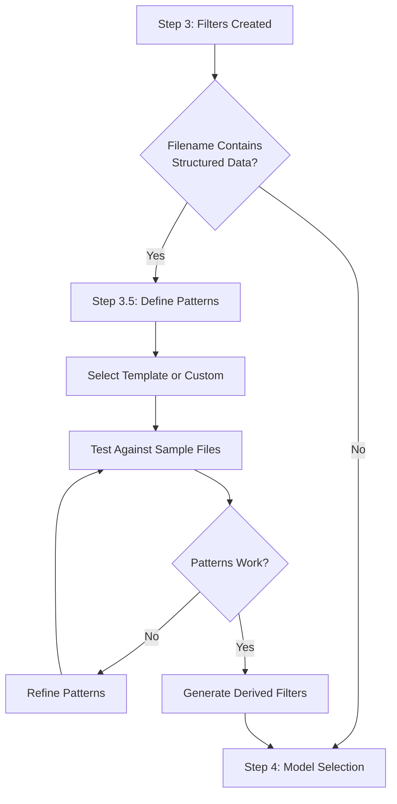

# Design: User-Driven Metadata Extraction

## Overview

This design enables users to teach the corpus wizard about their document organization through an interactive pattern definition interface.

## Design Principles

1. **Show, Don't Tell**: Users define patterns by example, not abstract syntax
2. **Progressive Disclosure**: Start simple, reveal complexity as needed
3. **Test-Driven**: Validate patterns against real files immediately
4. **Fail-Safe**: Skip if too complex, don't block corpus creation
5. **Template-First**: Provide common patterns users can adapt

## User Flow



## Component Architecture

### Frontend Components

```
CorpusWizard.vue
├── MetadataPatternStep.vue (New)
│   ├── PatternTemplateSelector.vue
│   ├── FolderMappingBuilder.vue
│   ├── FilenamePatternBuilder.vue
│   ├── PatternTester.vue
│   └── DerivedFilterBuilder.vue
```

### Backend Modules

```
backend/modules/
├── metadata_extraction.py (New)
│   ├── PatternMatcher
│   ├── MetadataExtractor
│   └── FilterDeriver
├── corpus_analyzer.py (Modified)
│   └── extract_metadata_from_path()
└── corpus_builder.py (Modified)
    └── enrich_documents_with_metadata()
```

## Pattern Definition Language

### Design Decision: Simplified Patterns vs Full Regex

**Choice: Simplified patterns with escape to regex**

Users define patterns using placeholders:
- `{field_name}` - Capture text
- `{field_name:d}` - Capture digits
- `{field_name:w}` - Capture word characters
- `{field_name:/regex/}` - Escape to regex for power users

**Rationale:**
- Readable by non-programmers
- Covers 90% of use cases simply
- Power users can still use regex
- Easy to visualize in UI

### Pattern Templates

Pre-built templates for common corpus organizations:

#### 1. Parliamentary Records
```yaml
name: "Parliamentary Hansard"
folder_pattern:
  0: "{country}"
  1: "{chamber}"
filename_pattern: "{day_of_week}, {day:d} {month}, {year:d}"
```

#### 2. Scientific Papers
```yaml
name: "Academic Papers"
folder_pattern:
  0: "{year:d}"
  1: "{journal}"
filename_pattern: "{author_surname}_{year:d}_{title}"
```

#### 3. Legal Documents
```yaml
name: "Court Cases"
folder_pattern:
  0: "{jurisdiction}"
  1: "{court_level}"
  2: "{year:d}"
filename_pattern: "{case_id:d}_{parties}_{date}"
```

#### 4. Correspondence
```yaml
name: "Letter Collection"
folder_pattern:
  0: "{decade:d}s"
  1: "{year:d}"
filename_pattern: "{date}_{from}_to_{to}"
```

## UI/UX Design

### Pattern Builder Interface

```
┌─────────────────────────────────────────────────────────────┐
│ 📁 Folder Structure Mapping                                 │
├─────────────────────────────────────────────────────────────┤
│                                                              │
│ Your structure:        Maps to:           Type:             │
│ data/                                                        │
│ └── Australia     →    [country    ▼]    [Category ▼]      │
│     └── House...  →    [parliament ▼]    [Category ▼]      │
│         └── 1901  →    [year       ▼]    [Number   ▼]      │
│                                                              │
│ Preview: Each document will have:                           │
│ • country: "Australia"                                      │
│ • parliament: "House_of_Representatives"                    │
│ • year: 1901                                               │
└─────────────────────────────────────────────────────────────┘

┌─────────────────────────────────────────────────────────────┐
│ 📄 Filename Pattern Extraction                              │
├─────────────────────────────────────────────────────────────┤
│                                                              │
│ Choose a template:  [Parliamentary Hansard ▼]               │
│                                                              │
│ Sample file: Friday, 02 August, 1901.txt                    │
│                                                              │
│ Pattern builder:                                             │
│ ┌──────────────────────────────────────────────────┐       │
│ │ Friday, 02 August, 1901                          │       │
│ │ ───┬─── ─┬ ───┬── ──┬─                          │       │
│ │    ↓     ↓    ↓     ↓                            │       │
│ │ {day_of_week}, {day:d} {month}, {year:d}         │       │
│ └──────────────────────────────────────────────────┘       │
│                                                              │
│ ✅ Extracted values:                                        │
│ • day_of_week: "Friday"                                     │
│ • day: 2                                                    │
│ • month: "August"                                           │
│ • year: 1901                                               │
│                                                              │
│ [Test More Files]  [Accept Pattern]  [Edit Pattern]         │
└─────────────────────────────────────────────────────────────┘
```

### Derived Filter Builder

```
┌─────────────────────────────────────────────────────────────┐
│ 🔍 Create Smart Filters                                     │
├─────────────────────────────────────────────────────────────┤
│                                                              │
│ Available fields: country, parliament, year, day_of_week,   │
│                  day, month                                 │
│                                                              │
│ Quick filters:                                              │
│ □ By day of week (Monday, Tuesday, ...)                    │
│ ☑ By month (January, February, ...)                        │
│ ☑ By year (1901, 1902, ...)                               │
│ □ By season (Spring, Summer, ...)                          │
│                                                              │
│ Custom filter:                                              │
│ Name: [Weekend Sessions                    ]               │
│ When: [day_of_week ▼] [equals ▼] [Saturday,Sunday    ]    │
│ [+ Add Condition]                                           │
│                                                              │
│ Preview: Will match 12 documents                            │
│                                                              │
│ [Create Filter]  [Skip Derived Filters]                    │
└─────────────────────────────────────────────────────────────┘
```

## Implementation Strategy

### Phase 1: Core Pattern Matching (Days 1-3)
1. Implement `PatternMatcher` class
2. Add simplified pattern syntax parser
3. Create pattern validation logic
4. Unit tests for pattern matching

### Phase 2: UI Components (Days 4-6)
1. Create `MetadataPatternStep.vue`
2. Build interactive pattern builder
3. Implement live preview
4. Add pattern templates

### Phase 3: Integration (Days 7-8)
1. Modify corpus analyzer
2. Update document loading
3. Store metadata in vector store
4. Test with real corpora

### Phase 4: Testing & Polish (Days 9-10)
1. End-to-end testing
2. Performance optimization
3. Documentation
4. Template library

## Technical Decisions

### Metadata Storage

**Decision: Store in document metadata**
```python
document.metadata = {
    "source": "/path/to/file.txt",
    "corpus": "all",
    # New extracted fields
    "country": "Australia",
    "year": 1901,
    "month": "August",
    "day": 2,
    "day_of_week": "Friday"
}
```

### Pattern Compilation

**Decision: Compile to regex at build time**
```python
# User pattern
"{day_of_week}, {day:d} {month}, {year:d}"

# Compiled regex
r"(?P<day_of_week>\w+), (?P<day>\d+) (?P<month>\w+), (?P<year>\d+)"
```

### Filter Generation

**Decision: Generate ChromaDB where clauses**
```python
# Derived filter
{
    "id": "fridays",
    "label": "Friday Sessions",
    "where": {"day_of_week": "Friday"}
}
```

## Error Handling

1. **Pattern doesn't match**: Show specific mismatch location
2. **Conflicting patterns**: Use first match, warn user
3. **Invalid regex**: Fall back to literal matching
4. **Too many fields**: Limit to 20 metadata fields
5. **Performance issues**: Batch extraction, show progress

## Security Considerations

1. **Regex DoS**: Timeout pattern matching after 1 second
2. **Path traversal**: Sanitize extracted values
3. **Injection**: Escape metadata before storage
4. **Memory**: Limit pattern complexity

## Future Enhancements

1. **AI-Assisted Patterns**: Use LLM to suggest patterns
2. **Pattern Library**: Share patterns between users
3. **Conditional Patterns**: Different patterns for different folders
4. **Validation Rules**: Ensure extracted values are valid
5. **Metadata Enrichment**: Derive additional fields (season from month, etc.)